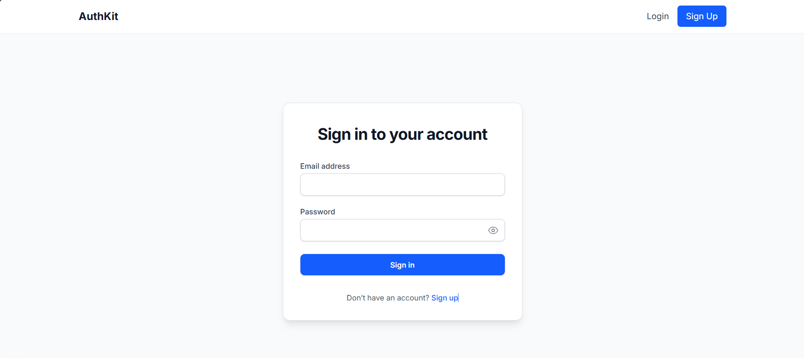

# Next.js Full-Stack Authentication Starter 🔐

A production-ready Next.js starter with complete authentication system using MongoDB and NextAuth.js.

## ✨ Features

- ⚡ **Next.js 14** with App Router
- 🔐 **Complete Authentication System** (Register, Login, Logout)
- 🗄️ **MongoDB** integration with Mongoose
- 🔑 **NextAuth.js** for session management
- 🎨 **Tailwind CSS** for styling
- 🛡️ **Protected Routes** with middleware
- 📱 **Responsive Design**
- 🚀 **Production Ready**

## 🚀 Quick Start

### 1. Clone or Download

Download this and extract to your project folder.

### 2. Install Dependencies
```bash
npm install
```

### 3. Setup Environment Variables

Create `.env.local` file in root:
```env
MONGODB_URI=your_mongodb_connection_string
NEXTAUTH_SECRET=generate_random_32_char_string
NEXTAUTH_URL=http://localhost:3000
```

**Getting MongoDB URI:**
1. Create free account at [MongoDB Atlas](https://www.mongodb.com/cloud/atlas)
2. Create cluster
3. Get connection string

**Generate NEXTAUTH_SECRET:**
Generate a secure secret and add it to your environment variables.
### Option 1: OpenSSL
```bash
openssl rand -base64 32
```
### Option 2: Node.js(VS code/CMD)
```bash
node -e "console.log(require('crypto').randomBytes(32).toString('base64'))"
```
### Option 3: PowerShell
```bash
[Convert]::ToBase64String((1..32 | ForEach-Object { Get-Random -Maximum 256 }))
```
### Then Add to .env.local
```bash
NEXTAUTH_SECRET=your_generated_secret
```

### 4. Run Development Server
```bash
npm run dev
```

Visit `http://localhost:3000`

## 👀 Preview

#### Dashboard


#### Login


#### Register


## 📁 Project Structure
```
├── app/
│   ├── api/auth/          # Authentication API routes
│   ├── dashboard/         # Protected dashboard page
│   ├── login/            # Login page
│   ├── register/         # Registration page
│   └── layout.tsx        # Root layout
├── components/
│   └── Navbar.tsx        # Navigation component
├── lib/
│   ├── auth.ts           # NextAuth configuration
│   └── db.ts             # MongoDB connection
├── models/
│   └── User.ts           # User model
└── middleware.ts         # Route protection
```

## 🎯 Usage

### Register New User

1. Navigate to `/register`
2. Fill in name, email, password
3. Submit form
4. Redirected to login

### Login

1. Navigate to `/login`
2. Enter credentials
3. Access dashboard

### Protected Routes

Add routes to middleware to protect them:
```typescript
export const config = {
  matcher: ["/dashboard/:path*", "/profile/:path*"],
};
```

## 🔧 Customization

### Add More User Fields

Edit `models/User.ts`:
```typescript
const UserSchema = new Schema({
  name: String,
  email: String,
  password: String,
  role: { type: String, default: "user" },  // Add this
  avatar: String,  // Add this
});
```

### Change Styling

All pages use Tailwind CSS. Modify classes in component files.

### Add API Routes

Create new routes in `app/api/` directory.

## 🌐 Deployment

### Vercel (Recommended)

1. Push to GitHub
2. Import to Vercel
3. Add environment variables
4. Deploy

### Environment Variables for Production
```env
MONGODB_URI=your_production_mongodb_uri
NEXTAUTH_SECRET=your_production_secret
NEXTAUTH_URL=https://yourdomain.com
```

## 🛠️ Tech Stack

- **Framework:** Next.js 16
- **Language:** TypeScript
- **Styling:** Tailwind CSS
- **Database:** MongoDB
- **Auth:** NextAuth.js
- **Deployment:** Vercel-ready

## 📝 License

This template is free to use for personal and commercial projects.

## 🤝 Support

For issues or questions, please open an issue on GitHub or contact support.

## 🎁 What's Included

- Complete source code
- Full documentation
- Ready-to-deploy setup
- Example pages and components
- Production-ready configuration

---

**Built with ❤️ for developers who want to ship faster**
